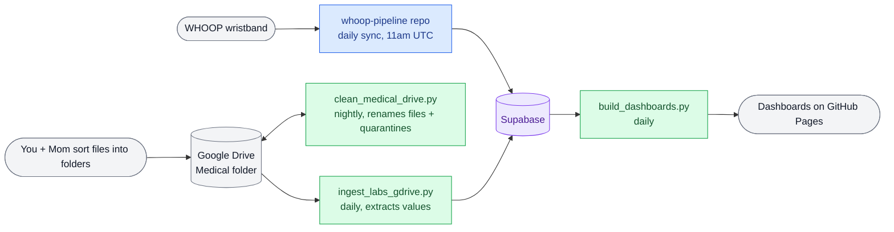

# vital-signal-reports

Automated personal biometric dashboard pipeline. Two provider-facing HTML dashboards rebuild daily via GitHub Actions and are served live on GitHub Pages.

## How it fits together

Two independent GitHub repos feed one shared Supabase database. Blue = the other repo (`whoop-pipeline`), green = scripts in *this* repo, purple = the shared database.

**Two rows above, two jobs:**
- **Top row (WHOOP):** lives entirely in [`whoop-pipeline`](https://github.com/fernandomartinez-de/whoop-pipeline), a separate private repo. It syncs WHOOP → Supabase on its own daily schedule. Nothing here touches it.
- **Bottom row (labs/imaging):** you and your mom drop files into Drive, sorted by hand into the right `{year}/{category}/` folder. `clean_medical_drive.py` now runs fully unattended every night WITH `--apply` — no one has to click anything. It reads each file's actual content and renames confidently-resolved files in place to match their real date/category/provider — it never moves those files between folders, that stays a human job; if a document itself is unclear, it trusts the folder it's already sitting in as a fallback signal for category. Anything it still can't confidently resolve gets moved into `Medical/_REVISAR` (prefixed `REVISAR_`) for a human to sort out by hand — that folder is the nightly safety net your mom checks and fixes; confirmed duplicates land there too, prefixed `DUP_`. `ingest_labs_gdrive.py` then runs automatically every night, trusting only correctly-named files, and inserts the extracted values into Supabase.

Once both rows have landed in Supabase, `build_dashboards.py` runs automatically every evening, rebuilds the two Spanish dashboards, and GitHub Pages serves the latest version to your doctors.

## Dashboards

| Dashboard | Audience | Language |
|---|---|---|
| `martinez_nutritionist_dashboard.html` | Nutriólogo (Javier) | Spanish |
| `martinez_oncologist_dashboard.html` | Oncóloga (Dra. Escobar) | Spanish |

Live at: `https://fernandomartinez-de.github.io/vital-signal-reports/`

## Automation (this repo)

| Workflow | Trigger | Does |
|---|---|---|
| `clean-medical-drive.yml` | Daily, 7am UTC (applies automatically) + manual | Runs `clean_medical_drive.py`. The nightly schedule always runs with `--apply` — no manual click needed. A manual trigger is dry-run unless you check `apply`. Uploads `rename_log.csv` as an artifact. |
| `ingest-labs.yml` | Daily, 8am UTC | Runs `ingest_labs_gdrive.py`. |
| `rebuild-dashboards.yml` | Daily, 6pm UTC | Runs `build_dashboards.py`, commits the rebuilt dashboards. |

`whoop-pipeline` has its own workflow in its own repo.

## Stack

| Layer | Tool |
|---|---|
| Wearable sync | [`whoop-pipeline`](https://github.com/fernandomartinez-de/whoop-pipeline) — separate repo |
| Database | Supabase (PostgreSQL), shared by both repos |
| Lab/imaging source | Google Drive |
| Automation | GitHub Actions |
| Hosting | GitHub Pages |

## Setup

1. Clone the repo, `pip install -r requirements.txt`
2. Add repo secrets: `SUPABASE_DB_URL`, `ANTHROPIC_API_KEY`, `GDRIVE_CREDENTIALS` (service account JSON)
3. Give that service account **Editor** access on the Medical Drive folder — the cleaner needs to rename files and move duplicates/unresolved files into `_REVISAR`
4. Enable GitHub Pages on `main`
5. Everything else runs automatically, including the cleaner's nightly `--apply` run — no manual trigger needed for normal operation

## Notes

Personal health monitoring project. Dashboard content is in Spanish, tailored to specific provider workflows. Data is private.
