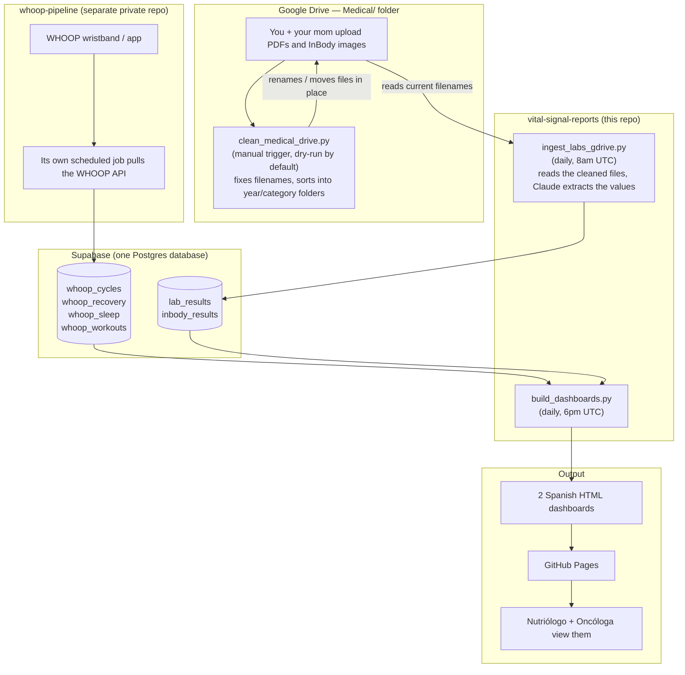

# vital-signal-reports

Automated personal biometric dashboard pipeline built on WHOOP wearable data plus lab/imaging results. Two provider-facing HTML dashboards rebuild daily via GitHub Actions and are served live on GitHub Pages.

## What it does

- Pulls WHOOP metrics (recovery, strain, sleep) into Supabase — via a **separate** private repo, [`whoop-pipeline`](https://github.com/fernandomartinez-de/whoop-pipeline), not this one
- Keeps a Google Drive "Medical" folder clean and correctly named, since files get uploaded by more than one person
- Ingests lab PDFs and InBody scans from that Drive folder, extracts values with Claude, and inserts them into Supabase
- Builds two tailored HTML dashboards in Spanish: one for a nutritionist, one for an oncologist
- Publishes both dashboards automatically every day via GitHub Actions
- No manual intervention required day-to-day — the folder cleaner is the one manual/review step

## Two repos, one database

This repo and `whoop-pipeline` are independent GitHub repos that don't know about each other. The only thing they share is the destination: they both write into the same Supabase database, into different tables. Nothing in `whoop-pipeline` touches Google Drive, and nothing in this repo touches the WHOOP API.



## Walking through it

**The WHOOP side (a different repo entirely).** Your WHOOP wristband syncs to WHOOP's own app/API. `whoop-pipeline` — a separate private repo with its own GitHub Action on its own schedule — pulls from that API and writes recovery/strain/sleep/workout data straight into Supabase. This repo never touches that process; it just reads the tables `whoop-pipeline` fills.

**The Drive side (this repo, two steps).**
1. You and your mom drop lab PDFs, ultrasound/radiology PDFs, pathology reports, and InBody screenshots into the "Medical" folder on Google Drive, organized as `Medical/{year}/{category}/`.
2. `clean_medical_drive.py` is a manual-trigger GitHub Action. You run it (dry run first) and it reads what's actually written inside each file — not the filename — to work out the real date, category, and provider, then renames/moves the file to match the convention. Anything it can't confidently read, or that turns out to be a duplicate, gets set aside in a `_REVISAR` folder for you to look at by hand. It never deletes anything.
3. `ingest_labs_gdrive.py` runs automatically every night. It only trusts filenames that already follow the convention (`_labs_` in the name, a valid date up front) — which is exactly what step 2 guarantees. It reads each file with Claude and inserts the extracted lab/InBody values into Supabase.

**Bringing it together.** Once both `whoop_*` tables and `lab_results`/`inbody_results` have the day's data, `build_dashboards.py` runs automatically every evening, pulls everything from Supabase, and rebuilds the two Spanish HTML dashboards — one framed for your nutritionist, one for your oncologist. Those get committed back into this repo and served live on GitHub Pages, so your doctors always see the latest version at a fixed URL.

## Dashboards

| Dashboard | Audience | Language |
|---|---|---|
| `martinez_nutritionist_dashboard.html` | Nutriólogo (Javier) | Spanish |
| `martinez_oncologist_dashboard.html` | Oncóloga (Dra. Escobar) | Spanish |

Both dashboards are live at:
```
https://fernandomartinez-de.github.io/vital-signal-reports/
```

## Stack

| Layer | Tool |
|---|---|
| Wearable data | WHOOP → [`whoop-pipeline`](https://github.com/fernandomartinez-de/whoop-pipeline) (separate repo) |
| Data storage | Supabase (PostgreSQL) — shared by both repos |
| Lab/imaging data source | Google Drive |
| Drive folder hygiene | Python (`clean_medical_drive.py`) |
| Ingestion | Python (`ingest_labs_gdrive.py`) |
| Dashboard build | Python (`build_dashboards.py`) |
| Automation | GitHub Actions |
| Hosting | GitHub Pages |

## Automation (this repo)

| Workflow | Trigger | Does |
|---|---|---|
| `.github/workflows/clean-medical-drive.yml` | Manual (`workflow_dispatch`) | Runs `clean_medical_drive.py`. Dry-run by default; check the `apply` box to actually rename/move files. Uploads `rename_log.csv` as an artifact every run. |
| `.github/workflows/ingest-labs.yml` | Daily, 8am UTC (+ manual) | Runs `ingest_labs_gdrive.py`. |
| `.github/workflows/rebuild-dashboards.yml` | Daily, 6pm UTC (+ manual) | Runs `build_dashboards.py` and commits/pushes the two rebuilt dashboards. |

`whoop-pipeline` has its own workflow(s) in its own repo — not listed here.

## Setup

1. Clone the repo
2. Install dependencies: `pip install -r requirements.txt`
3. Configure the following secrets in your GitHub repository settings:
   - `SUPABASE_DB_URL`
   - `ANTHROPIC_API_KEY`
   - `GDRIVE_CREDENTIALS` (Google service account JSON)
4. Give that service account **Editor** (not just Viewer) access on the Medical Drive folder — the cleaner needs to rename/move files
5. Enable GitHub Pages on the `main` branch
6. The workflows handle all subsequent runs automatically, except the cleaner, which you trigger manually

## Notes

This is a personal health monitoring project. Dashboard content is in Spanish and tailored to specific provider workflows. Data is private and sourced exclusively from personal wearable and lab integrations.
